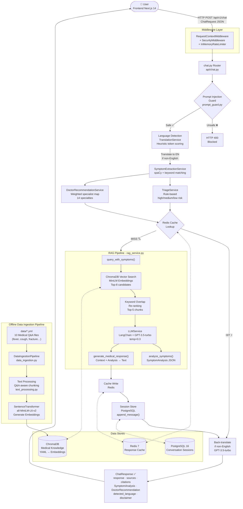

# AI Healthcare Chatbot — Full Codebase Architecture Analysis

---

## 1. What This Application Does

The **AI Healthcare Chatbot** is a full-stack, production-grade intelligent medical assistant that allows users to:

- **Chat in natural language** about symptoms, health concerns, and general medical questions
- **Receive AI-powered symptom analysis** with severity scoring (1–10) and risk triage (Low / Medium / High)
- **Get specialist doctor recommendations** from a weighted symptom-to-specialist mapping engine
- **Access RAG-augmented responses** grounded in a curated medical knowledge base (YAML Q&A files ingested into a local ChromaDB vector store)
- **Use the app in 8 languages** — EN, ES, FR, HI, DE, PT, AR, ZH with auto-detection and GPT-3.5-powered translation
- **Generate structured health reports** summarizing the conversation history
- **Work safely** via prompt injection guards, rate limiting, response caching, and a built-in medical disclaimer system

---

## 2. Core Tech Stack

### Backend
| Layer | Technology |
|---|---|
| API Framework | **FastAPI** (Python 3.x) |
| ASGI Server | **Uvicorn** |
| LLM Integration | **LangChain + OpenAI GPT-3.5-turbo** |
| Embeddings | **Sentence Transformers** (`all-MiniLM-L6-v2`) |
| Vector Store | **ChromaDB** (persistent, local) |
| NLP | **spaCy** (`en_core_web_sm`, optional) |
| Database | **PostgreSQL 16** (session persistence) |
| Cache | **Redis 7** (response caching) |
| Data Validation | **Pydantic v2** |
| Settings | **pydantic-settings** |

### Frontend
| Layer | Technology |
|---|---|
| Framework | **Next.js 14** (App Router) |
| Language | **TypeScript** |
| UI Components | **Radix UI** primitives |
| Animations | **Framer Motion** |
| Icons | **Lucide React** |
| Styling | **Tailwind CSS v3** |
| Testing | **Jest + Testing Library** |

### Infrastructure
| Component | Technology |
|---|---|
| Containerization | **Docker / Docker Compose** |
| Reverse Proxy | **Nginx** |
| Deployment | **Render.yaml** (Render.com), **Vercel** (frontend) |
| CI/CD | **GitHub Actions** |

---

## 3. Architectural Patterns

### 3a. Backend — Layered / Clean Architecture

```
HTTP Request → Middleware → Router → Service Layer → Repository Layer → DB/Cache
```

| Layer | Location | Responsibility |
|---|---|---|
| **Middleware** | `app/middleware/` | Rate limiting, security, request context tagging |
| **Router/Controller** | `app/api/` | Input validation, orchestration, HTTP response shaping |
| **Service Layer** | `app/services/` | Business logic (LLM, RAG, triage, caching, reports) |
| **AI Sub-layer** | `app/ai/` | Prompt injection guard, translation service |
| **Repository Layer** | `app/repositories/` | Vector DB (ChromaDB), SQL session store (PostgreSQL) |
| **Domain Models** | `app/models/` | Pydantic schemas: `ChatRequest`, `ChatResponse`, `SymptomAnalysis`, `DoctorRecommendation` |
| **Core** | `app/core/` | DI container (`Depends()`), settings (env vars), structured logging |

### 3b. RAG Pipeline — Hybrid Retrieval-Augmented Generation

The RAG pattern combines **semantic vector search** with **lexical keyword re-ranking**:

1. **Ingestion** *(offline)*: YAML medical Q&A files → chunked → embedded (MiniLM) → stored in ChromaDB
2. **Retrieval**: Query embedded → top-8 candidates from ChromaDB → re-ranked by keyword overlap score → top-5 chunks selected
3. **Augmentation**: Context + symptom analysis packed into LangChain `ChatPromptTemplate`
4. **Generation**: GPT-3.5-turbo generates the final grounded response

### 3c. Frontend — Feature-Sliced Next.js App Router

```
src/
  app/          ← Next.js App Router pages & layouts
  features/
    chat/       ← Chat UI feature slice
    analytics/  ← Analytics feature slice
  components/   ← Shared components
  hooks/        ← Custom React hooks
  services/     ← API client calls
  store/        ← State management
  styles/       ← Global CSS / Tailwind
```

### 3d. Dependency Injection

FastAPI's `Depends()` pattern wires all services via `app/core/dependencies.py`, enabling easy mocking in tests and keeping layers decoupled.

---

## 4. Data Flow: `ChatRequest` → `ChatResponse`

```
User Input (ChatRequest: message, symptoms?, preferred_language?)
  │
  ├─ [1] Prompt Injection Guard          → blocks unsafe inputs (HTTP 400)
  ├─ [2] Language Detection              → detect input language (heuristic tokens)
  ├─ [3] Translation to English          → GPT-3.5 translation if non-EN
  ├─ [4] Symptom Extraction              → spaCy NLP + keyword matching → List[str]
  ├─ [5] Rule-Based Triage               → TriageService → SymptomAnalysis (severity, risk)
  ├─ [6] Doctor Recommendation           → DoctorRecommendationService → DoctorRecommendation
  ├─ [7] Redis Cache Lookup              → return cached response if hit
  │
  └─ [8] RAG Pipeline (on cache miss)
          ├─ Vector search (ChromaDB / MiniLM embeddings) → top-8 docs
          ├─ Keyword overlap re-ranking  → top-5 context chunks + citations
          └─ LLM Service (LangChain + GPT-3.5-turbo)
                ├─ analyze_symptoms()    → SymptomAnalysis JSON
                └─ generate_medical_response() → grounded text response
  │
  ├─ [9]  Cache Write (Redis)
  ├─ [10] Session Persistence (PostgreSQL: append user + assistant messages)
  ├─ [11] Back-translate to user's language if non-English
  │
  └─ ChatResponse {
       response, conversation_id,
       sources[], citations[],
       symptom_analysis (severity, risk_level, possible_conditions, urgency),
       doctor_recommendation (specialist, confidence, reasoning, alternatives),
       detected_language, disclaimer
     }
```

---

## 5. Request Flow — Mermaid Diagram



---

## 6. Key Design Decisions

| Decision | Rationale |
|---|---|
| **Local ChromaDB** instead of a cloud vector DB | Zero cost, offline-capable, no extra API key needed for retrieval |
| **Hybrid retrieval** (vector + keyword re-ranking) | Improves result relevance for medical terminology that may not embed well |
| **Rule-based triage alongside LLM** | Guarantees a safety baseline even when the LLM API is unavailable |
| **Redis caching** | Prevents repeated LLM API calls for identical queries — reduces cost & latency |
| **Graceful LLM-off mode** | All services have heuristic/keyword fallbacks if `OPENAI_API_KEY` is absent |
| **Prompt injection guard** | Dedicated `prompt_guard.py` screens every user input before any LLM call |
| **Session in PostgreSQL** | Enables persistent, auditable conversation history across sessions |
| **Multi-language support** | Auto-detects input language; routes through GPT-3.5 for pre/post-translation |
| **Pydantic v2 schemas** | Strong contract between layers; `ChatRequest` and `ChatResponse` fully typed |
| **Feature-sliced frontend** | `features/chat` and `features/analytics` isolate domain concerns in the UI |

---

## 7. Infrastructure Overview

```
Internet
    │
    ▼
  Nginx (port 80) — reverse proxy
    ├── /api/* ──► FastAPI Backend   (port 8000, Uvicorn)
    └── /*     ──► Next.js Frontend  (port 3000)

Backend dependencies:
    ├── PostgreSQL 16  (port 5432, named volume: pgdata)
    ├── Redis 7        (port 6379)
    └── ChromaDB       (local filesystem, ./chroma_db/)
```

All services are orchestrated via **Docker Compose** with schema auto-migration via `postgres_schema.sql` on first boot.
