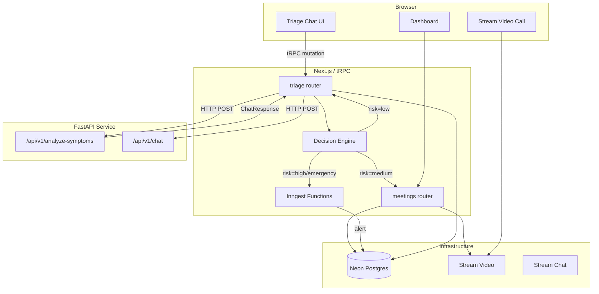

# Healthcare Decision Engine Integration Plan

## Current State Analysis

**Meet-AI** (`src/`): Next.js 15 + tRPC v11 + Stream Video/Chat + Inngest + Drizzle/Neon + Better Auth. Modules: `agents`, `meetings`, `call`, `auth`, `dashboard`, `home`. tRPC router has `agents` and `meetings` sub-routers only. Empty placeholder at [src/lib/medicalIntelligence.ts](src/lib/medicalIntelligence.ts).

**Healthcare Chatbot** (`Ai-Healthcare-Chatbot-master/backend/`): FastAPI on port 8000. Endpoints: `POST /api/v1/chat`, `POST /api/v1/analyze-symptoms`, `GET /api/v1/health`. Returns `ChatResponse` with `symptom_analysis` (`risk_level: low|medium|high`, `severity_score: 1-10`), `doctor_recommendation` (`specialist`, `confidence`, `reasoning`, `alternative_specialists`).

**No existing bridge** between the two systems. `medicalIntelligence.ts` is empty.

---

## Critical Dependency to Verify FIRST

**FastAPI `RiskLevel` enum has only `low | medium | high` -- NO `emergency` level.**

```6:9:Ai-Healthcare-Chatbot-master/backend/app/models/chat.py
class RiskLevel(str, Enum):
    LOW = "low"
    MEDIUM = "medium"
    HIGH = "high"
```

The user requirement specifies four tiers: low, medium, high, emergency. **Decision required:** either add `EMERGENCY` to the FastAPI `RiskLevel` enum and update `TriageService.assess()` to emit it (e.g., severity >= 9 with critical signals like "unconscious", "stroke", "heart attack"), or handle emergency as a sub-case of `high` in the decision engine by checking `severity_score >= 9`. **This must be resolved before Phase 2.**

---

## Verified FastAPI Response Contract

```json
{
  "response": "string",
  "conversation_id": "string",
  "sources": ["string"] | null,
  "citations": [{"id": "string", "source": "string", "excerpt": "string"}] | null,
  "symptom_analysis": {
    "symptoms": ["string"],
    "severity_score": 1-10,
    "risk_level": "low" | "medium" | "high",
    "possible_conditions": ["string"],
    "urgency_recommendation": "string"
  } | null,
  "detected_language": "string" | null,
  "recommended_specialist": "string" | null,
  "doctor_recommendation": {
    "specialist": "string",
    "confidence": 0.0-1.0,
    "reasoning": "string",
    "alternative_specialists": ["string"]
  } | null,
  "disclaimer": "string"
}
```

Request body:

```json
{
  "message": "string",
  "conversation_id": "string" | null,
  "user_id": "string" | null,
  "symptoms": ["string"] | null,
  "preferred_language": "string" | null
}
```

---

## Integration Architecture




---

## Phase 1: Triage Integration (FastAPI to Next.js)

**Objective:** Create a typed HTTP client in Next.js that calls the FastAPI `/api/v1/analyze-symptoms` and `/api/v1/chat` endpoints, and expose these through a new `triage` tRPC router.

### Subtasks

**1.1 — Create FastAPI client types and HTTP wrapper**

- **File to create:** `src/modules/triage/server/fastapi-client.ts`
- **What it does:** Typed `fetch` wrapper for FastAPI. Uses server-side `fetch` (no browser). Reads `FASTAPI_BASE_URL` from env.
- **Types to define (mirroring FastAPI exactly):**
  - `FastApiChatRequest` = `{ message, conversation_id?, user_id?, symptoms?, preferred_language? }`
  - `FastApiChatResponse` = full `ChatResponse` shape from contract above
  - `FastApiSymptomAnalysis` = `{ symptoms, severity_score, risk_level, possible_conditions, urgency_recommendation }`
  - `FastApiDoctorRecommendation` = `{ specialist, confidence, reasoning, alternative_specialists }`
  - `FastApiRiskLevel` = `"low" | "medium" | "high"` (or `| "emergency"` if added)
- **Functions:**
  - `analyzeSymptoms(req: FastApiChatRequest): Promise<FastApiChatResponse>` -- calls `POST /api/v1/analyze-symptoms`
  - `chatWithBot(req: FastApiChatRequest): Promise<FastApiChatResponse>` -- calls `POST /api/v1/chat`
  - `checkHealth(): Promise<{ status: string }>` -- calls `GET /api/v1/health`
- **Error handling:** Timeout (10s), retry once on 5xx, throw typed `FastApiError` on 4xx/5xx.
- **Input/Output:** Takes typed request, returns typed response or throws.

**1.2 — Add environment variable**

- **File to modify:** `.env` -- add `FASTAPI_BASE_URL=http://localhost:8000`
- **File to modify:** `next.config.ts` -- add `FASTAPI_BASE_URL` to `env` or `serverRuntimeConfig` if needed (server-only, so no `NEXT_PUBLIC_` prefix).

**1.3 — Create Zod schemas for validation**

- **File to create:** `src/modules/triage/schemas.ts`
- **Defines:** Zod schemas matching FastAPI request/response for runtime validation on tRPC boundary. Includes `triageRequestSchema`, `triageChatRequestSchema`.

**1.4 — Create tRPC triage router**

- **File to create:** `src/modules/triage/server/procedures.ts`
- **Procedures:**
  - `triage.analyzeSymptoms` (mutation) -- input: `{ message: string, symptoms?: string[], preferredLanguage?: string }`, calls `analyzeSymptoms()`, persists triage session (Phase 4), returns `TriageResult`
  - `triage.chat` (mutation) -- input: `{ message: string, conversationId?: string, preferredLanguage?: string }`, calls `chatWithBot()`, returns chat response
  - `triage.getSession` (query) -- input: `{ id: string }`, fetches triage session from DB
  - `triage.getSessions` (query) -- paginated list of user's triage sessions
- **All use `protectedProcedure`** from [src/trpc/init.ts](src/trpc/init.ts).

**1.5 — Register triage router**

- **File to modify:** [src/trpc/routers/_app.ts](src/trpc/routers/_app.ts) -- add `triage: triageRouter` to `appRouter`.

### Dependencies

- FastAPI service must be running and reachable from Next.js server.
- `FASTAPI_BASE_URL` env var must be set.

### Failure Points

- FastAPI is down or unreachable: client must handle gracefully with fallback error message.
- Response shape mismatch: Zod validation will catch this. Must add logging for parse failures.
- Latency: FastAPI RAG + LLM calls can take 5-15s. tRPC mutations need appropriate timeout. Consider adding a loading/streaming UI state.

---

## Phase 2: Decision Engine Logic

**Objective:** Build the core routing logic that maps `risk_level` + `severity_score` to an action (precautions, video consultation, or escalation).

### Subtasks

**2.1 — Define decision engine types**

- **File to create:** `src/modules/triage/types.ts`
- **Types:**
  - `TriageDecision = { action: "precautions" | "consultation" | "escalation", riskLevel: string, severityScore: number, precautions?: string[], meetingId?: string, agentId?: string, escalationDetails?: EscalationDetails }`
  - `EscalationDetails = { alertSent: boolean, urgencyMessage: string, recommendedSpecialist: string }`
  - `TriageSessionStatus = "pending" | "triaged" | "consultation_scheduled" | "consultation_completed" | "escalated"`

**2.2 — Implement decision engine**

- **File to create:** `src/modules/triage/server/decision-engine.ts`
- **Function:** `evaluateTriageDecision(analysis: FastApiChatResponse): TriageDecision`
- **Logic:**
  - `risk_level === "low"` OR (`severity_score <= 3`) --> `action: "precautions"`, extract precautions from `response` field
  - `risk_level === "medium"` OR (`severity_score` between 4-7 and `risk_level !== "high"`) --> `action: "consultation"`, prepare to auto-create meeting
  - `risk_level === "high"` OR (`severity_score >= 8`) --> `action: "escalation"`, set `escalationDetails`
  - If `EMERGENCY` is added to FastAPI: `risk_level === "emergency"` --> same as escalation but with different urgency level
- **Pure function, no side effects.** Side effects (DB writes, meeting creation) happen in the tRPC procedure that calls this.

**2.3 — Create medical agent template**

- **File to create:** `src/modules/triage/server/medical-agent-template.ts`
- **Purpose:** Generate agent `instructions` text tailored to the patient's symptoms, risk level, and recommended specialist. Used when auto-creating a consultation agent.
- **Function:** `buildMedicalAgentInstructions(params: { symptoms: string[], riskLevel: string, specialist: string, urgencyRecommendation: string }): string`

**2.4 — Wire decision engine into triage router**

- **File to modify:** `src/modules/triage/server/procedures.ts`
- Add `triage.evaluateAndRoute` (mutation):
  - Input: `{ message: string, symptoms?: string[] }`
  - Calls `analyzeSymptoms()` --> `evaluateTriageDecision()` --> based on `action`:
    - `precautions`: return precautions data, persist session with status `triaged`
    - `consultation`: auto-create agent + meeting (reuse logic from `meetings.create`), persist session with `consultation_scheduled`, return meeting link
    - `escalation`: persist session with `escalated`, trigger Inngest alert event, return escalation details
  - Output: `TriageDecision` with populated fields

### Dependencies

- Phase 1 complete (FastAPI client + triage router).
- Must clarify `emergency` vs `high` distinction (see critical dependency above).

### Failure Points

- False positives on high risk: the rule-based triage in FastAPI is simplistic (keyword matching). Boundary between medium and high is fragile.
- Agent auto-creation could fail if Stream Video API is down.
- Decision logic must be deterministic and auditable -- log every decision with inputs.

---

## Phase 3: Meet-AI Call Triggering

**Objective:** When the decision engine determines `action: "consultation"`, automatically create an AI agent, a meeting, and redirect the user to the video call.

### Subtasks

**3.1 — Extract meeting creation logic into a shared service**

- **File to create:** `src/modules/meetings/server/meeting-service.ts`
- **Refactor:** Extract the core meeting + Stream Video call creation logic from the existing `meetings.create` procedure ([src/modules/meetings/server/procedures.ts](src/modules/meetings/server/procedures.ts)) into a reusable function:
  - `createMeetingWithCall(params: { name, userId, agentId, meetingType?: "standard" | "triage_consultation" }): Promise<{ meetingId: string }>`
  - This function: inserts into `meetings` table, creates Stream Video call with transcription enabled, upserts agent user in Stream.
- **Existing `meetings.create` procedure** calls this function instead of inlining the logic.

**3.2 — Extract agent creation logic**

- **File to create:** `src/modules/agents/server/agent-service.ts`
- **Refactor:** Extract agent insert logic from `agents.create` procedure into:
  - `createAgent(params: { name, userId, instructions }): Promise<{ agentId: string }>`
- **Existing `agents.create` procedure** calls this function.

**3.3 — Wire auto-consultation in the triage flow**

- **File to modify:** `src/modules/triage/server/procedures.ts` -- `triage.evaluateAndRoute` mutation:
  - On `action: "consultation"`:
    1. Call `createAgent()` with medical instructions from `buildMedicalAgentInstructions()`
    2. Call `createMeetingWithCall()` with the new agent
    3. Store `meetingId` in the triage session
    4. Return `{ action: "consultation", meetingId, redirectUrl: "/call/{meetingId}" }`

**3.4 — Add meeting type discriminator**

- **File to modify:** [src/db/schema.ts](src/db/schema.ts) -- add optional `meetingType` column to `meetings` table (`"standard" | "triage_consultation"`, default `"standard"`).
- This allows filtering/querying consultation-originated meetings separately.

### Dependencies

- Phase 2 complete (decision engine).
- Stream Video API keys configured and working.
- Agent + meeting creation logic must be idempotent (user retrying shouldn't create duplicates).

### Failure Points

- Stream Video `call.create` fails: must handle gracefully, mark triage session as `consultation_failed`, allow retry.
- Race condition: user submits triage twice rapidly, gets two meetings. Guard with a check on triage session status before creating.
- The auto-created agent has generic medical instructions -- quality of the AI consultation depends on how well `buildMedicalAgentInstructions()` is written.

---

## Phase 4: Data Persistence (DB Changes)

**Objective:** Add database tables to persist triage sessions, decisions, and link them to meetings.

### Subtasks

**4.1 -- New DB table: `triage_sessions`**

- **File to modify:** [src/db/schema.ts](src/db/schema.ts)
- **Schema:**

```typescript
export const triageSessionStatus = pgEnum("triage_session_status", [
  "pending",
  "triaged",
  "consultation_scheduled",
  "consultation_completed",
  "escalated",
]);

export const triageSessions = pgTable("triage_sessions", {
  id: text("id").primaryKey().$defaultFn(() => nanoid()),
  userId: text("user_id").notNull().references(() => user.id, { onDelete: "cascade" }),
  fastapiConversationId: text("fastapi_conversation_id"),
  status: triageSessionStatus("status").notNull().default("pending"),
  // Snapshot of FastAPI response
  symptoms: text("symptoms"),          // JSON stringified string[]
  severityScore: text("severity_score"),
  riskLevel: text("risk_level"),       // "low" | "medium" | "high" | "emergency"
  possibleConditions: text("possible_conditions"),  // JSON stringified string[]
  urgencyRecommendation: text("urgency_recommendation"),
  recommendedSpecialist: text("recommended_specialist"),
  doctorRecommendation: text("doctor_recommendation"),  // JSON stringified
  // Decision engine output
  decisionAction: text("decision_action"), // "precautions" | "consultation" | "escalation"
  precautions: text("precautions"),        // JSON stringified string[]
  // Link to meeting if consultation was created
  meetingId: text("meeting_id").references(() => meetings.id, { onDelete: "set null" }),
  agentId: text("agent_id").references(() => agents.id, { onDelete: "set null" }),
  // Raw FastAPI response for audit
  rawResponse: text("raw_response"),    // Full JSON
  createdAt: timestamp("created_at").notNull().defaultNow(),
  updatedAt: timestamp("updated_at").notNull().defaultNow(),
});
```

**4.2 -- Add `meetingType` enum and column to `meetings`**

- **File to modify:** [src/db/schema.ts](src/db/schema.ts)
- Add `meetingType` enum: `"standard" | "triage_consultation"`
- Add column to `meetings` table: `meetingType: meetingType("meeting_type").notNull().default("standard")`

**4.3 -- Run migration**

- Execute `npm run db:push` (Drizzle Kit push to Neon).

**4.4 -- Update triage procedures to persist**

- **File to modify:** `src/modules/triage/server/procedures.ts`
- After calling FastAPI and decision engine, insert/update row in `triage_sessions`.
- On consultation creation, update `meetingId` and `agentId` on the triage session.

### Dependencies

- Phase 1 (router exists to call from).
- Drizzle Kit and `DATABASE_URL` configured.

### Failure Points

- Migration on production Neon DB: must be additive only (new tables, new columns with defaults). No destructive changes.
- JSON-stringified fields are not queryable. If advanced queries on symptoms/conditions are needed later, consider a JSONB column or normalized join table. Acceptable for MVP.

---

## Phase 5: UI Integration (Chat + Routing)

**Objective:** Build the triage chat UI, display decision results, and handle routing to video calls or escalation alerts.

### Subtasks

**5.1 -- Create triage module UI structure**

Files to create (feature-sliced):

- `src/modules/triage/ui/views/triage-view.tsx` -- main triage page
- `src/modules/triage/ui/components/triage-chat.tsx` -- chat interface for symptom input
- `src/modules/triage/ui/components/triage-result.tsx` -- displays decision (precautions / consultation link / escalation alert)
- `src/modules/triage/ui/components/symptom-input.tsx` -- structured symptom entry (optional, can also be free-text)
- `src/modules/triage/ui/components/risk-badge.tsx` -- colored badge for risk level
- `src/modules/triage/ui/components/precautions-card.tsx` -- displays precautions for low-risk
- `src/modules/triage/ui/components/escalation-alert.tsx` -- emergency/high-risk alert banner

**5.2 -- Create triage page route**

- **File to create:** `src/app/(dashboard)/triage/page.tsx` -- server component, prefetch, session check, render `TriageView`
- **File to create:** `src/app/(dashboard)/triage/loading.tsx` -- loading state
- **File to create:** `src/app/(dashboard)/triage/[sessionId]/page.tsx` -- view a specific triage session result

**5.3 -- Add triage to sidebar navigation**

- **File to modify:** `src/modules/dashboard/ui/components/dashboard-sidebar.tsx` -- add "Triage" or "Symptom Check" link with appropriate icon (e.g., `HeartPulseIcon` from lucide).

**5.4 -- Add triage to middleware protected routes**

- **File to modify:** [src/middleware.ts](src/middleware.ts) -- add `"/triage"` to `protectedRoutes` array.

**5.5 -- Triage chat flow (UI behavior)**

- User enters symptoms as free text (or selects from a list).
- On submit, calls `triage.evaluateAndRoute` mutation.
- While waiting: loading state with "Analyzing symptoms..."
- On response:
  - **Low risk:** Show `PrecautionsCard` with precautions, disclaimer, and a "Chat more" option (uses `triage.chat`).
  - **Medium risk:** Show `TriageResult` with risk info + "Start Video Consultation" button. Button navigates to `/call/{meetingId}` (meeting was auto-created).
  - **High/Emergency:** Show `EscalationAlert` with urgent messaging, recommended specialist, and instructions to seek emergency care. Optionally also show the consultation link.

**5.6 -- Triage history list**

- **File to create:** `src/modules/triage/ui/views/triage-history-view.tsx`
- Shows past triage sessions with status, risk level, date, linked meeting if any.
- Route: could be a tab on `/triage` or a separate `/triage/history` page.

**5.7 -- Create triage hooks**

- **File to create:** `src/modules/triage/hooks/use-triage.ts` -- custom hook wrapping `triage.evaluateAndRoute` mutation with loading/error states.

### Dependencies

- Phases 1-4 complete (backend fully wired).
- shadcn/ui components already available in [src/components/ui/](src/components/ui/).

### Failure Points

- UX for long-running FastAPI calls: mutation can take 5-15s. Must show clear loading state, possibly with a progress indicator.
- Navigation to `/call/{meetingId}` after auto-creation: meeting must be in `upcoming` status for `CallView` to render (it blocks on `completed`). Verify the status is correct.
- Mobile responsiveness: triage chat must work on mobile viewports.

---

## Phase 6: Doctor Dashboard Integration (Optional / Future)

**Objective:** Provide a view for doctors/specialists to see escalated triage sessions and consultation outcomes.

### Subtasks

**6.1 -- Role-based access**

- Add `role` column to `user` table (`"patient" | "doctor" | "admin"`, default `"patient"`).
- Update middleware and `protectedProcedure` to support role checks.

**6.2 -- Doctor dashboard page**

- **File to create:** `src/app/(dashboard)/doctor/page.tsx`
- Shows: escalated triage sessions, scheduled consultations, completed consultations with summaries.

**6.3 -- tRPC procedures for doctor view**

- Add `triage.getEscalated` (query) -- returns escalated sessions (doctor-only).
- Add `triage.getConsultations` (query) -- returns consultation-linked meetings with summaries.

**6.4 -- Notification system for escalations**

- Use Inngest to send notifications (email/webhook) when a triage session is escalated.
- **File to create:** `src/inngest/triage-escalation.ts`
- **Inngest event:** `triage/escalated` -- triggered from `triage.evaluateAndRoute` on high/emergency.

### Dependencies

- Phases 1-5 complete.
- Decision on notification channel (email, SMS, in-app).

### Failure Points

- Role system requires auth changes (Better Auth custom fields or separate role table).
- Doctor availability/scheduling is out of scope for this phase -- consultations are AI-only initially.

---

## Identified Risks


| Risk                                                                                              | Severity | Mitigation                                                                                                             |
| ------------------------------------------------------------------------------------------------- | -------- | ---------------------------------------------------------------------------------------------------------------------- |
| **Tight coupling to FastAPI response shape**                                                      | High     | Zod validation at tRPC boundary; version the client; log parse failures                                                |
| **FastAPI latency** (RAG + LLM = 5-15s)                                                           | Medium   | Show loading states; consider WebSocket/SSE for streaming; add timeout with fallback                                   |
| **FastAPI downtime**                                                                              | High     | Health check before triage; graceful degradation with "service unavailable" message; circuit breaker pattern in client |
| **False triage classification**                                                                   | High     | Log all decisions with full inputs for audit; add disclaimer on every result; allow user to override/retry             |
| **Data inconsistency** (triage session says "consultation_scheduled" but meeting creation failed) | Medium   | Use transaction-like pattern: create meeting first, then update triage session; add reconciliation check               |
| **Duplicate meeting creation** on retry                                                           | Medium   | Check triage session status before creating; idempotency key on triage session ID                                      |
| **Security: FastAPI has no auth**                                                                 | High     | FastAPI is server-to-server only (not exposed to browser); add API key auth header; restrict CORS                      |
| **Memory leak in FastAPI** (in-memory `SessionRepository`)                                        | Low      | Not critical for integration; Meet-AI persists in Neon. FastAPI sessions are transient.                                |
| **Env var management**                                                                            | Low      | Single `.env` already exists; add `FASTAPI_BASE_URL` and optionally `FASTAPI_API_KEY`                                  |


---

## Critical Path (Must Be Done First)

1. **Verify/extend FastAPI `RiskLevel`** -- decide on `emergency` handling (Phase 0 decision)
2. **Phase 1.1-1.2** -- FastAPI client + env var (everything else depends on this)
3. **Phase 4.1** -- DB schema (triage procedures need the table)
4. **Phase 1.4** -- tRPC triage router (UI needs this)
5. **Phase 2.2** -- Decision engine (core logic)
6. **Phase 3.1-3.2** -- Extract meeting/agent service (consultation creation depends on this)

Everything else can proceed in parallel after these are done.

---

## Folder Structure (Final)

```
src/
  modules/
    triage/
      server/
        procedures.ts          # tRPC router
        fastapi-client.ts      # HTTP client for FastAPI
        decision-engine.ts     # Risk -> Action mapping
        medical-agent-template.ts  # Agent instructions builder
      ui/
        views/
          triage-view.tsx
          triage-history-view.tsx
        components/
          triage-chat.tsx
          triage-result.tsx
          symptom-input.tsx
          risk-badge.tsx
          precautions-card.tsx
          escalation-alert.tsx
      hooks/
        use-triage.ts
      schemas.ts               # Zod schemas
      types.ts                 # TypeScript types
      params.ts                # URL search params (nuqs)
    meetings/
      server/
        procedures.ts          # (modified) uses meeting-service
        meeting-service.ts     # (new) extracted creation logic
    agents/
      server/
        procedures.ts          # (modified) uses agent-service
        agent-service.ts       # (new) extracted creation logic
  app/
    (dashboard)/
      triage/
        page.tsx
        loading.tsx
        [sessionId]/
          page.tsx
          loading.tsx
  db/
    schema.ts                  # (modified) add triage_sessions, meetingType
  inngest/
    functions.ts               # (modified or new file) add triage escalation
  trpc/
    routers/
      _app.ts                  # (modified) add triage router
  middleware.ts                # (modified) add /triage to protected routes
```

---

## Files Modified vs Created Summary

**Modified (existing):**

- `src/trpc/routers/_app.ts` -- add triage router
- `src/db/schema.ts` -- add `triage_sessions` table, `meetingType` column
- `src/middleware.ts` -- add `/triage` to protected routes
- `src/modules/meetings/server/procedures.ts` -- extract to service
- `src/modules/agents/server/procedures.ts` -- extract to service
- `src/modules/dashboard/ui/components/dashboard-sidebar.tsx` -- add nav link
- `.env` -- add `FASTAPI_BASE_URL`

**Created (new):**

- `src/modules/triage/server/procedures.ts`
- `src/modules/triage/server/fastapi-client.ts`
- `src/modules/triage/server/decision-engine.ts`
- `src/modules/triage/server/medical-agent-template.ts`
- `src/modules/triage/schemas.ts`
- `src/modules/triage/types.ts`
- `src/modules/triage/hooks/use-triage.ts`
- `src/modules/triage/ui/views/triage-view.tsx`
- `src/modules/triage/ui/views/triage-history-view.tsx`
- `src/modules/triage/ui/components/triage-chat.tsx`
- `src/modules/triage/ui/components/triage-result.tsx`
- `src/modules/triage/ui/components/symptom-input.tsx`
- `src/modules/triage/ui/components/risk-badge.tsx`
- `src/modules/triage/ui/components/precautions-card.tsx`
- `src/modules/triage/ui/components/escalation-alert.tsx`
- `src/modules/meetings/server/meeting-service.ts`
- `src/modules/agents/server/agent-service.ts`
- `src/app/(dashboard)/triage/page.tsx`
- `src/app/(dashboard)/triage/loading.tsx`
- `src/app/(dashboard)/triage/[sessionId]/page.tsx`
- `src/app/(dashboard)/triage/[sessionId]/loading.tsx`

