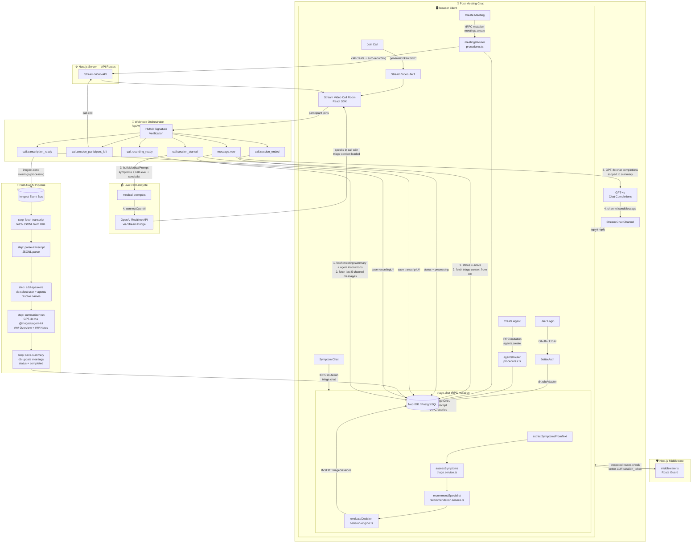

# Med-AI: Comprehensive Architecture Overview

> **Project**: `med-ai` (Capstone, LPU SEM 7)  
> **Analysis Date**: April 26, 2026  
> **Codebase**: `c:\My Stuff\LPU\SEM 7\Capstone\med-ai`

---

## 1. What This Application Does

**Med-AI** is a full-stack AI-powered **medical consultation platform** that bridges intelligent triage with live AI video consultations. Users are guided through a three-phase journey:

| Phase | What Happens |
|---|---|
| **🩺 Triage Chat** | User describes symptoms in a chat interface. An AI decision engine analyzes them, scores severity, and recommends a specialist. |
| **📹 AI Video Consultation** | Based on triage risk level, a video meeting is auto-suggested. An OpenAI Realtime API agent joins the call, pre-loaded with the patient's triage context (symptoms, risk, recommended specialist). |
| **💬 Post-Meeting Chat** | After the call ends, a GPT-4o summarizer creates a structured meeting summary, and users can continue chatting with the AI agent scoped to that summary. |

**Key capabilities:**
- **Real-time AI symptom triage** — deterministic NLP + rule-based decision engine (no LLM latency for triage itself)
- **Specialist recommendation** — maps symptoms to specialists with confidence scoring
- **Dynamic context injection** — triage data flows directly into the AI agent's realtime session instructions
- **Background AI summarization** — Inngest processes transcripts with GPT-4o asynchronously via retryable steps
- **Scoped post-meeting Q&A** — GPT-4o is restricted to answering only from the meeting summary

---

## 2. Core Tech Stack & Frameworks

| Layer | Technology | Version |
|---|---|---|
| **Framework** | Next.js (App Router, React Server Components) | 15.5.2 |
| **Language** | TypeScript | ^5 |
| **Runtime** | React | 19.1.0 |
| **Database** | PostgreSQL via Neon (serverless) | @neondatabase/serverless ^1.0.1 |
| **ORM** | Drizzle ORM | ^0.44.5 |
| **Auth** | BetterAuth (Google/GitHub OAuth + Email) | ^1.3.7 |
| **API Layer** | tRPC v11 + TanStack Query v5 | tRPC ^11.7.1 |
| **Video Calls** | Stream Video React SDK + Node SDK | ^1.26.1 / ^0.7.20 |
| **Chat** | Stream Chat React SDK + Node SDK | ^13.12.0 / ^9.26.0 |
| **AI – Realtime** | OpenAI Realtime API (via Stream bridge) | openai ^6.9.1 |
| **AI – Summarization** | Inngest Agent Kit + GPT-4o | @inngest/agent-kit ^0.13.2 |
| **AI – Post-Meeting** | OpenAI Chat Completions (GPT-4o) | — |
| **Background Jobs** | Inngest (event-driven, serverless) | ^3.45.1 |
| **UI Components** | shadcn/ui (Radix UI + Tailwind CSS v4) | — |
| **Tables** | TanStack Table | ^8.21.3 |
| **Schema Validation** | Zod | ^4.1.12 |
| **URL State** | nuqs | ^2.7.3 |
| **Avatars** | DiceBear (`initials`, `botttsNeutral`) | ^9.2.4 |
| **Styling** | Tailwind CSS v4 | ^4 |

---

## 3. Main Architectural Patterns

### 3.1 Next.js App Router with Route Groups
```
src/app/
  (auth)/           → sign-in, sign-up (public)
  (dashboard)/      → agents, meetings, triage (protected)
  call/[meetingId]/ → full-screen in-call experience
  api/
    trpc/           → tRPC handler
    inngest/        → Inngest webhook receiver
    auth/           → BetterAuth handler
    webhook/        → Stream.io webhook orchestrator
```

### 3.2 Feature-Sliced Module Architecture
Each domain in `src/modules/<feature>/` follows a strict predictable structure:
```
src/modules/<feature>/
  ├── server/
  │   ├── procedures.ts      # tRPC router (all DB queries live here)
  │   ├── decision-engine.ts # Pure domain logic (triage only)
  │   └── medical-prompt.ts  # Prompt builders (triage only)
  ├── services/
  │   ├── triage.service.ts          # Symptom extraction & scoring
  │   └── recommendation.service.ts  # Specialist mapping
  ├── ui/                   # React components & page views
  ├── hooks/                # Client-side TanStack Query hooks
  ├── schemas.ts            # Zod validation schemas
  ├── types.ts              # TypeScript types
  └── params.ts             # URL search param definitions (nuqs)
```

**Modules:** `agents` · `auth` · `call` · `dashboard` · `home` · `meetings` · `triage`

### 3.3 Type-Safe API via tRPC + TanStack Query
All client↔server communication uses tRPC v11 mounted at `/api/trpc`. A `protectedProcedure` middleware validates BetterAuth sessions on every mutation/query before any handler executes.

### 3.4 Edge Middleware for Route Guards
`src/middleware.ts` intercepts all non-API routes and:
- Redirects unauthenticated users away from `/agents`, `/meetings`, `/triage`
- Redirects already-authenticated users away from `/sign-in`, `/sign-up`

### 3.5 Webhook-as-Orchestrator Pattern
`/api/webhook/route.ts` is the **operational brain** of the live call lifecycle. Stream.io pushes HMAC-signed events and this single handler orchestrates **6 distinct event types**: session start, participant left, session end, transcription ready, recording ready, and post-meeting chat.

### 3.6 Event-Driven Background Processing (Inngest)
Post-call AI processing is **fully asynchronous**. The webhook fires `meetings/processing` and returns immediately. The Inngest function handles heavy lifting in isolated, retryable `step.run()` blocks with automatic checkpointing.

### 3.7 Deterministic Triage Decision Engine
The triage pipeline deliberately avoids LLM calls for the core risk assessment to ensure **speed, consistency, and zero hallucination risk**. A rules-based NLP service extracts symptoms from free text, a scoring function computes a severity score, and `evaluateDecision()` maps risk levels to triage actions — all synchronously in the tRPC mutation. GPT-4o is only called for the live voice conversation.

---

## 4. Database Schema

```
user ──────────────────────────────────────────────────────┐
   │                                                        │
   ├── session (FK: userId)                                 │
   ├── account (FK: userId)                                 │
   ├── agents  (FK: userId) ─────────────────────┐          │
   ├── meetings (FK: userId, FK: agentId) ────────┘          │
   │       │                                               │
   │       └── triageSessions (FK: userId, FK: meetingId?) ┘
   └────────────────────────────────────────────────────────┘
```

**`meetings` status lifecycle:**
```
upcoming → active → processing → completed
                 ↘ cancelled
```

**`triageSessions` key columns:** `symptoms` (JSON), `riskLevel`, `severityScore`, `specialistRecommendation`, `decisionAction`, `rawMessages` (JSON), `meetingId?` (linked after consultation)

---

## 5. Data Flow: Input (triage `procedures.ts`) → Output (Inngest `functions.ts`)

### Phase A — Triage Input (tRPC mutation: `triage.chat`)

```
User types symptoms in chat
        ↓
triage/procedures.ts → triage.chat mutation
        ↓
extractSymptomsFromText(message)       [triage.service.ts]
        ↓
assessSymptoms(symptoms, raw_text)     [triage.service.ts]
  → { riskLevel, severityScore, possibleConditions, ... }
        ↓
recommendSpecialist(symptoms)          [recommendation.service.ts]
  → { specialist, confidence, reasoning, alternatives }
        ↓
evaluateDecision(analysis, recommendation)  [decision-engine.ts]
  → { action, shouldCreateMeeting, precautions, urgencyMessage }
        ↓
db.insert(triageSessions) ← stored in NeonDB
        ↓
Return { response, decision, conversationId } to client
```

### Phase B — Meeting Kickoff (tRPC → Stream → Webhook)

```
User starts meeting (decision.shouldCreateMeeting = true)
        ↓
meetings.create (tRPC) → db.insert(meetings) + stream.call.create()
        ↓
meetings.generateToken (tRPC) → Stream Video JWT
        ↓
Client joins Stream Video call room
        ↓
[Stream fires call.session_started] → /api/webhook
        ↓
Webhook handler:
  1. db.update(meetings) → status: "active"
  2. db.select(triageSessions) ← fetch triage context for this meeting/user
  3. buildMedicalPrompt({ symptoms, riskLevel, specialist })
  4. streamVideo.video.connectOpenAi({ call, agentUserId })
  5. realtimeClient.updateSession({ instructions: medicalPrompt + agentInstructions })
        ↓
OpenAI Realtime API agent joins call with PATIENT'S TRIAGE CONTEXT pre-loaded
```

### Phase C — Post-Call AI Output (Stream → Inngest `functions.ts`)

```
Last human leaves call
        ↓
[Stream: call.session_participant_left] → webhook → call.end()
        ↓
[Stream: call.session_ended] → webhook → db.update(meetings, status: "processing")
        ↓
[Stream: call.transcription_ready] → webhook:
  1. db.update(meetings, { transcriptUrl })
  2. inngest.send({ name: "meetings/processing", data: { meetingId, transcriptUrl } })
        ↓
──────────────── Inngest functions.ts ────────────────
step: fetch-transcript  → fetch(transcriptUrl) → raw JSONL text
step: parse-transcript  → JSONL.parse<StreamTranscriptItem>()
step: add-speakers      → db.select(user + agents) → resolve speaker names
step: summarizer.run()  → GPT-4o via @inngest/agent-kit
                           ← structured Markdown (### Overview + ### Notes)
step: save-summary      → db.update(meetings, { summary, status: "completed" })
──────────────────────────────────────────────────────
        ↓
[Stream: call.recording_ready] → webhook → db.update(meetings, { recordingUrl })
        ↓
OUTPUT: meetings row with { status: "completed", summary, transcriptUrl, recordingUrl }
```

---

## 6. Mermaid Request Flow Diagram



---

## 7. Key Design Decisions & Trade-offs

| Decision | Rationale |
|---|---|
| **Deterministic triage engine (no LLM)** | Eliminates latency and hallucination risk for the critical risk-scoring path. Only GPT-4o handles the conversational layer. |
| **Triage context injected at call start** | The webhook handler reads `triageSessions` and builds a dynamic medical system prompt — the AI agent knows the patient's symptoms *before* speaking a word. |
| **Inngest for summarization** | Each pipeline step is isolated, retryable, and observable. A transcript fetch failure doesn't block speaker resolution. |
| **Single webhook route** | Centralizes all Stream event handling in one place, making the meeting lifecycle easy to trace and audit. |
| **tRPC + TanStack Query** | End-to-end type safety from DB to UI. No REST schema drift, automatic cache invalidation via `utils.invalidate()`. |
| **`medicalIntelligence.ts` is empty** | This file was planned as a central AI utility layer (referenced in open tabs) but has not yet been implemented — a planned abstraction. |

---

## 8. Modules Summary

| Module | Key Files | Responsibility |
|---|---|---|
| `triage` | `procedures.ts`, `decision-engine.ts`, `triage.service.ts`, `recommendation.service.ts` | Symptom NLP, risk scoring, specialist routing, session persistence |
| `meetings` | `procedures.ts`, `types.ts` | Meeting CRUD, Stream call creation, token generation, transcript retrieval |
| `agents` | `procedures.ts` | AI agent CRUD (name, instructions, persona) |
| `call` | `ui/` | In-call React components (video, audio, controls) |
| `dashboard` | `ui/` | Dashboard home, stats, navigation |
| `auth` | `ui/` | Sign-in/sign-up forms |
| `home` | `ui/` | Landing / home page |
